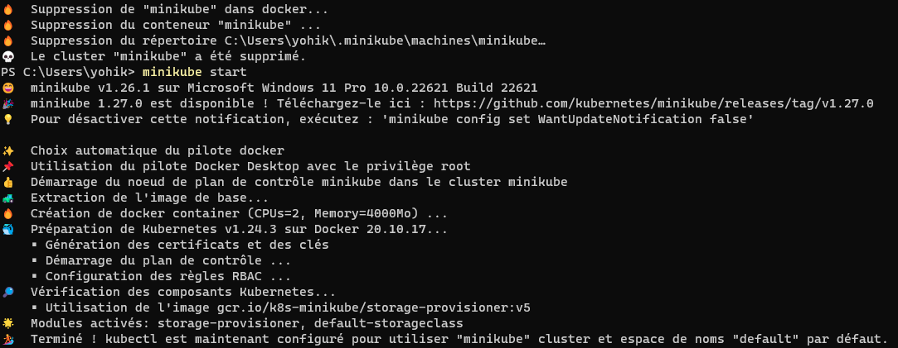
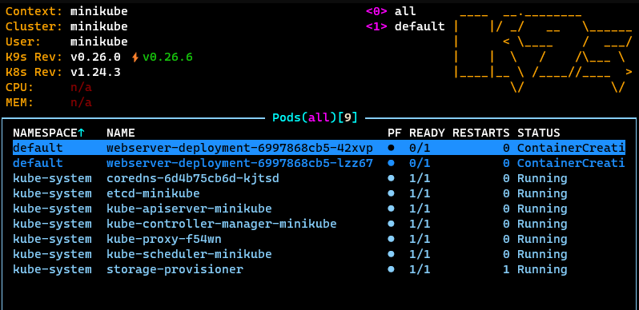
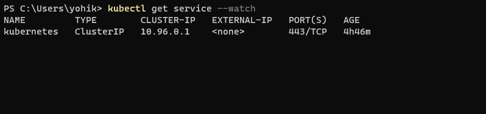
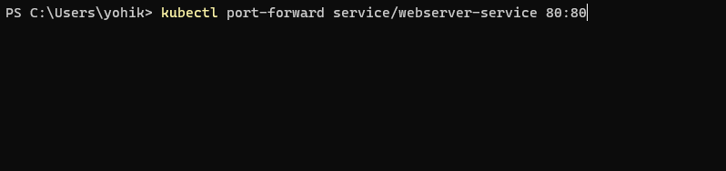
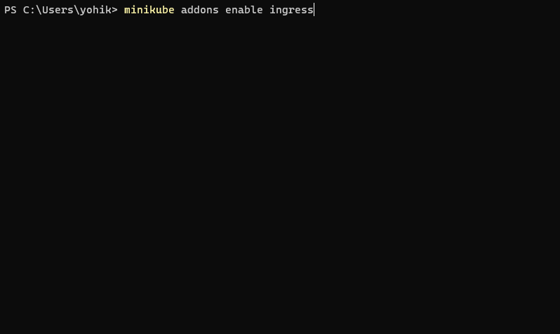
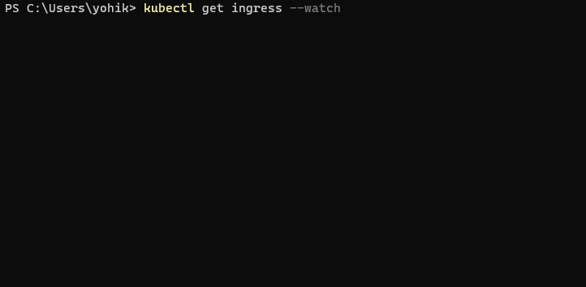
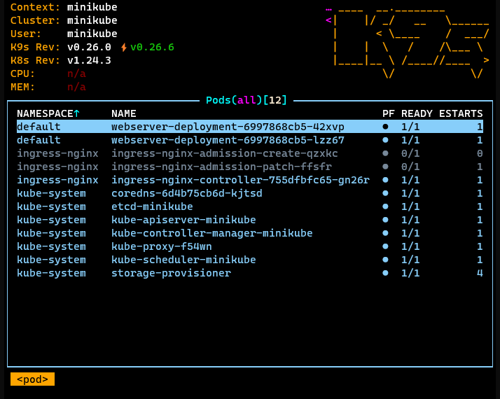
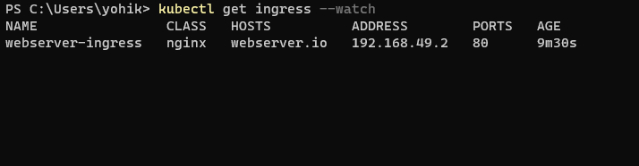

# Apprendre les bases de Kubernetes

A la fin de cet exercice vous connaîtrez les bases de Kubernetes, vous permettant ainsi de créer `pods`, `services`, `deployments` sur un cluster local (`minikube`).


## Partie 0 : Commandes de base

### `kubectl`

[Documentation officielle](https://kubernetes.io/docs/reference/generated/kubectl/kubectl-commands)

#### A retenir

* **resource_name** : c'est un `kind` de Kubernetes, ex: `pod` | `service` | `deployment` | ...
* **entity_name** : c'est le nom **unique** donné à une ressource.

commande                                                   | commentaire
-----------------------------------------------------------|----------------------------------------------------------------------------------
`$ kubectl get [resource_name] --all-namespaces`           | permet de lire l'ensemble des ressources demandées quelque soit le namespace
`$ kubectl delete [resource_name] [entity_name]`           | supprime une ressource du cluster
`$ kubectl create [resource_name] [entity_name] {...args}` | crée une ressource dans le cluster
`$ kubectl apply -f [definition_file_relative_path]`       | applique une configuration basée sur un fichier de définition en `YAML` ou `JSON`

> **Astuce** : maintenant que vous connaissez les commandes de base, vous saurez utiliser [k9s](https://k9scli.io/) sans le mysticisme qui peut l'accompagner.



## Partie 1 : Mon premier cluster

### Création d'un cluster (minikube)


Allez sur le site de [`minikube`](https://kubernetes.io/fr/docs/tasks/tools/install-minikube/) et suivez la documentation d'installation, selon votre OS.


> **Ce qu'il faut savoir**: Après l'installation de `minikube`, vous pourrez voir, dans votre cluster, apparaître les `pods` :
>
> pod|fonction
> -|-
> kube-apiserver|permet d'interagir avec le cluster
> kube-controller|permet de piloter les changements du cluster (upscale par exemple)
> kube-proxy|proxy permettant de piloter les règles réseau du cluster (services)
> kube-scheduler|permet d'assigner vos ``pods`` à vos ``nodes``
> etcd|espace de stockage clé-valeur à haute disponibilité pour les données du cluster
> storage-provisioner|permet de piloter la réservation d'espace disque pour le compte de ``minikube``
> coredns|CodeDNS est un server DNS
> cloud-controller-manager(absent de `minikube`)| permet d'interagir avec un cloud provider(créer des instances de node par exemple)

### Créer un pod nginx


1. Version CLI

```sh
$ kubectl run nginx --image=nginx:latest --restart=Never
```

2. Version YAML

```yaml
apiVersion: v1 # version des API de Kubernetes
kind: Pod # le type de ressource concernée
metadata:
  name: webserver # ... le nom
spec:
  containers:
  - name: webserver # le nom du conteneur qui sera utilisé dans le pod
    image: nginx:latest # l'image docker utilisée
    ports:
    - containerPort: 80 # le.s port.s exposés par le conteneur
```

```sh
$ kubectl apply -f <mon_nom_de_fichier_yaml>.yaml
```

### Créer un deployment ``nginx``



1. Version CLI

```bash
$ kubectl create deployment webserver-deployment --image=nginx --replicas=2
```

2. Version YAML

```yaml
apiVersion: apps/v1
kind: Deployment
metadata:
  name: webserver-deployment
  labels:
    app: nginx
spec:
  replicas: 2
  selector:
    matchLabels:
      app: nginx
  template:
    metadata:
      labels:
        app: nginx
    spec:
      containers:
      - name: nginx
        image: nginx
        ports:
        - containerPort: 80
```

```sh
$ kubectl apply -f <mon_nom_de_fichier_yaml>.yaml
```
### Créer un service 



#### Description

* Type `ClusterIP`
* Basé sur un ``pod`` ``nginx``
* Doit servir 2 ``pods``

1. Version CLI

```sh
$ kubectl create service clusterip nginx --tcp=80:80
```

2. Version ``YAML``

```yaml
apiVersion: v1
kind: Service
metadata:
  name: webserver-service
spec:
  selector:
    app: nginx
  ports:
    - protocol: TCP
      port: 80
      targetPort: 80
```
## Résultat attendu

Lorsque l'on fait un port forward d'un des ``pods``, nous arrivons sur la mire de nginx, sur le port `80`.




```sh
$ kubectl port-forward service/webserver-service 80:80
```

## Partie 2 : Access depuis l'extérieur

### Installer un `IngressController` basé sur ``nginx``

Dans le happy meal:



```sh
$ minikube addons enable ingress
```

Sur un Kubernetes classique :

```sh
$ kubectl apply -f https://raw.githubusercontent.com/kubernetes/ingress-nginx/controller-v0.44.0/deploy/static/provider/cloud/deploy.yaml
```

```sh
$ kubectl apply -f 05-install-ingressController.yaml
```

### Créer une ingress rule du protocole ``HTTP`` vers notre service nginx




```sh
$ kubectl create ingress ingress-webserver --rule=yolo.io/=webserver-service:80
```

```yaml
apiVersion: networking.k8s.io/v1
kind: Ingress
metadata:
  name: webserver-ingress
  annotations:
    nginx.ingress.kubernetes.io/rewrite-target: /$1
spec:
  ingressClassName: nginx
  rules:
    - host: webserver.io # ne pas oublier d'ajouter l'entrée dans son fichier HOST 
      http:
        paths:
          - path: /
            pathType: Prefix
            backend:
              service:
                name: webserver-service
                port:
                  number: 80

```
> **hint** : pour `minikube` il est nécessaire d'exécuter la commande `$ minikube tunnel` pour exposer le cluster.

## Résultat attendu

Une fois la partie Ingress effectuée, le service nginx devra être accessible depuis l'extérieur du cluster, sans port-forward.

## Partie 3 : Premier pas en sécurité
### Installer un cert-manager



```sh
$ kubectl apply -f https://github.com/cert-manager/cert-manager/releases/download/v1.9.1/cert-manager.yaml
```
### Créer un ClusterIssuer `selfSigned`


```yaml
apiVersion: cert-manager.io/v1
kind: ClusterIssuer
metadata:
  name: selfsigned
spec:
  selfSigned: {}

```
```sh
$ kubectl apply -f 08-issuer.yaml
```

### Créer un certificat TLS


```yaml
apiVersion: cert-manager.io/v1
kind: Certificate
metadata: 
  name: cert-webserver.io
spec: 
  issuerRef: 
    name: selfsigned
    kind: ClusterIssuer
  secretName: tls-webserver.io
  commonName: cert-webserver.io
  dnsNames:
    - webserver.io
```

```sh
$ kubectl apply -f 09-certificate.yaml
```


### Créer une ingress rule du protocole HTTPS vers notre service nginx



```yaml
apiVersion: networking.k8s.io/v1
kind: Ingress
metadata:
  name: webserver-ingress
  annotations:
    nginx.ingress.kubernetes.io/rewrite-target: /$1
spec:
  ingressClassName: nginx
  tls:
    - hosts:
        - webserver.io
      secretName: tls-webserver.io
  rules:
    - host: webserver.io
      http:
        paths:
          - path: /
            pathType: Prefix
            backend:
              service:
                name: webserver-service
                port:
                  number: 80

```

```sh
$ kubectl apply -f 10-ingress.yaml
```


### Résultat attendu 

Une fois la partie Ingress effectuée, le service nginx devra être accessible depuis l'extérieur du cluster en HTTPS.

> Le ClusterIssuer étant un `selfSigned`, votre navigateur ne reconnaîtra pas votre certificat comme valide. C'est normal, des solutions existent mais ne sont pas l'objet de cette formation.
